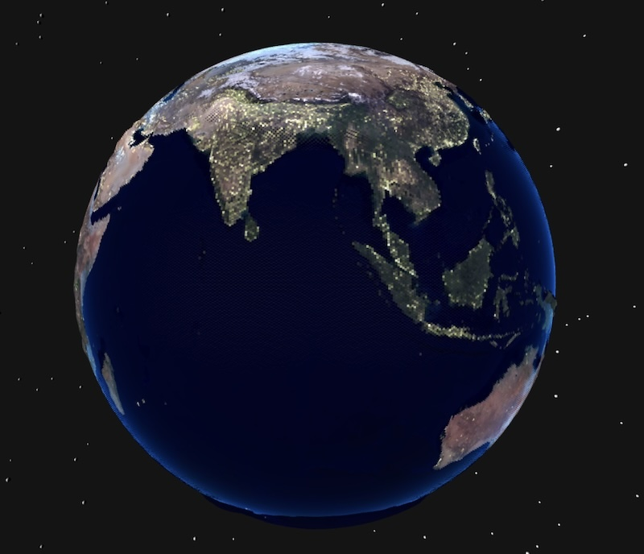

# THREE.js 

I am experimenting with using THREE.js in openprocessing.

Based on a couple of THREE.js tutorials by Bobby Roe, I recently created a sketch for #WCCChallenge "Earth", with a nod to "Hitchhiker's Guide to the Galaxy" by Douglas Adams. You can play with the sketch [here](https://openprocessing.org/sketch/2712156).

The challenge topic for this week is "Greenhouse."  I am still working on the sketch, but you can find the current version in the greenhouse folder.

TODO:
Add something inside the greenhouse.
Add a door!
Figure out best HDRi image.

## References

- [Rapier](https://github.com/dimforge/rapier.js)
- [Bobby Roe Physics Liquid glass repo](https://github.com/bobbyroe/physics-liquid-glass/tree/main)
- [Bobby Roe Physics with Rapier](https://github.com/bobbyroe/physics-with-rapier-and-three)
- [HDR Imaging](https://en.wikipedia.org/wiki/High_dynamic_range#High-dynamic-range_imaging)
- [THREE.js ultrahdr loader](https://threejs.org/examples/webgl_loader_texture_ultrahdr.html)
- [Polyhaven hdri's](https://polyhaven.com/hdris)